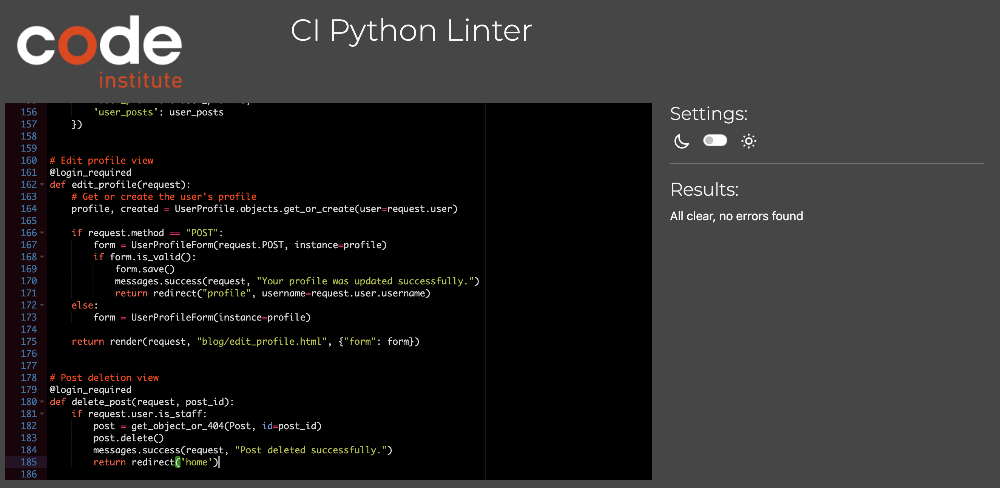

# The Notice Board

Click this link to view the live App - [The Notice Board](https://the-notice-board-cabc5e8a6edb.herokuapp.com/)

Celebrating the best of the UK, with blog posts covering everything from Sport to History, Geography to the Arts.

Welcome to The Notice Board, a platform for people to come together and discuss all things UK. The App allows users to create their own profiles and interact with the community. Whether you're here to share some interesting facts or looking to learn, the App is a great way to discover things that you may not have known about...

## Contents
+ [Project Aims](#project-aims "Project Aims")
+ [How to Use](#how-to-use "How to Use")
+ [User Stories & Epics](#user-stories--epics "User Stories & Epics")
    + [Epic: Content Management & Interaction](#epic-content-management--interaction "Epic: Content Management & Interaction")
    + [Epic: User Profiles & Account Management](#epic-user-profiles--account-management "Epic: User Profiles & Account Management")
    + [Epic: Post Navigation & Discovery](#epic-post-navigation--discovery "Epic: Post Navigation & Discovery")
+ [Design](#design "Design")
    + [ERD](#erd "ERD")
    + [Wireframes](#wireframes "Wireframes")
        + [Index](#index-1 "Index")
        + [About](#about-1 "About")
        + [Create Post](#create-post-1 "Create Post")
        + [My Profile](#my-profile-1 "My Profile")
        + [View Post](#view-posts "View Post")
    + [Fonts](#fonts "Fonts")
    + [Features](#features "Features")
        + [Navbar](#navbar "Navbar")
        + [My Profile](#my-profile "My Profile")
        + [Footer](#footer "Footer")
        + [Index](#index "Index")
        + [Posts](#posts "Posts")
            + [Post Messages](#post-messages "Post Messages")
        + [About](#about "About")
        + [Create Post](#create-post "Create Post")
            + [Create Post Messages](#create-post-messages "Create Post Messages")
        + [Sign Up, Login & Sign Out](#sign-up-login-and-sign-out "Sign Up, Login & Sign Out")
    + [Future Features](#future-features "Future Features")
        + [Profile Images](#profile-images "Profile Images")
        + [Notifications](#notifications "Notifications")
+ [Technologies Used](#technologies-used "Technologies User")
+ [Testing](#testing "Testing")
    + [Manual Testing](#manual-tests "Manual Testing")
        + [Index](#index-2 "Index Testing")
        + [Post_detail](#post_detail "Post_detail")
        + [Profile](#profile "Profile")
        + [Search](#search "Search")
    + [User Story Testing](#user-story-testing "User Story Testing")
    + [Code Validation](#code-validation "Code Validation")
        + [Manual JS Testing](#manual-js-testing "Manual HS Testing")
        + [HTML](#html "HTML")
        + [CSS](#css "CSS")
        + [Python](#python "Python")
    + [Fixed Bugs](#fixed-bugs "Fixed Bugs")
        + [Downvote counter](#1-downvote-counter "Downvote counter")
        + [Non registered users accessing profiles](#2-non-registered-users-accessing-profiles "Non registered users accessing profiles")
+ [Deployment](#deployment "Deployment")
    + [Local Deployment](#local-deployment "Local Deployment")
    + [Remote Deployment](#remote-deployment "Remote Deployment")
+ [Credits](#credits "Credits")
+ [Acknowledgments](#acknowledgments "Acknowledgments")

## Project Aims

Provide a platform for people to post interesting content relating to the UK
Allow users to create posts
Encourage community engagement by allowing users to comment and vote on posts
Provide a simple, visually pleasing layout that ensures users can consume the information easily
Ensure that the App can be scaled up and handle a larger number of posts over time
Offer security features to protect user data
Ensure administrators can easily moderate content and prevent misuse

## How to Use

Steps to use The Notice Board:

1. Create an account - You can do this by entering an email address and creating a password.
2. Update your profile - Add your personal information and a biography to help others get to know you.
3. Browse posts - Browse the website looking for interesting posts to engage with.
4. Comment/vote on posts - Let other users know what you think of their content and vote to inform potential readers.
5. Create posts - Contribute to the site and create posts for other users/site visitors to view an interact with.

## User Stories & Epics

All of my user stories were entered in a GitHub project - [Link](https://github.com/users/DanFNKD/projects/2)

### Epic: Content Management & Interaction

- (https://github.com/DanFNKD/the-notice-board/issues/10) - As a site user, I can view a limited number of posts per page so that I can browse content easily without being overwhelmed.
- (https://github.com/DanFNKD/the-notice-board/issues/2) - As a site user I can create posts so that I can contribute to the site.
- (https://github.com/DanFNKD/the-notice-board/issues/7) - As a site admin, I can approve, edit or delete any post so that I can ensure all content meets site standards.
- (https://github.com/DanFNKD/the-notice-board/issues/8) - As a site user, I can add tags to my posts so that I can categorise content and make it easier for others to find.
- (https://github.com/DanFNKD/the-notice-board/issues/3) - As a registered user, I can leave comments on posts so that I can engage with other users and participate in discussions.
- (https://github.com/DanFNKD/the-notice-board/issues/12) - As a site admin I can approve, edit or delete comments so that I can ensure all content meets site standards.
- (https://github.com/DanFNKD/the-notice-board/issues/13) - As a site admin, I can create and set Tags so that site users can assign them to their posts.
- (https://github.com/DanFNKD/the-notice-board/issues/4) - As a registered user, I can upvote or downvote posts so that I can express my opinion on content and help highlight popular posts.
- (https://github.com/DanFNKD/the-notice-board/issues/18) - As a site user, I can upload images when creating posts, so that I can make my content more engaging.
- (https://github.com/DanFNKD/the-notice-board/issues/19) - As a site admin, I want to manage images within posts so that I can remove or replace images to maintain site standards where necessary.
- (https://github.com/DanFNKD/the-notice-board/issues/17) - As a registered user, I can be notified if my comment is awaiting approval so that I can understand why it is not immediately visible on the site.

### Epic: User Profiles & Account Management

- (https://github.com/DanFNKD/the-notice-board/issues/1) - As a site user, I can register for an account and login so that I can access additional features and interact with the site.
- (https://github.com/DanFNKD/the-notice-board/issues/6) - As a registered user, I can view and edit my profile so that I can share relevant information about myself with others.
- (https://github.com/DanFNKD/the-notice-board/issues/14) - As a registered user, I can view other users' profiles so that I can learn more about the authors of posts I read.

### Epic: Post Navigation & Discovery

- (https://github.com/DanFNKD/the-notice-board/issues/15) - As a site user, I can search for posts so that I can find specific content.
- (https://github.com/DanFNKD/the-notice-board/issues/16) - As a site user, I can sort and filter posts so that I can quickly find tailored content to suit my interests.
- (https://github.com/DanFNKD/the-notice-board/issues/20) - As a site user, I want to filter posts by tags so that I can quickly find content relevant to specific topics.

## Design

### ERD

### Wireframes

#### Index

Desktop

Click to view

Mobile

Click to view

#### About

Desktop

Click to view

Mobile

Click to view

#### Create Post

Desktop

Click to view

Mobile

Click to view

#### My Profile

Desktop

Click to view

Mobile

Click to view

#### View Posts

Desktop

Click to view

Mobile

Click to view

### Fonts

Google Fonts were used in the project. Simplistic fonts were selected to improve readability.

- Roboto
- Lato

### Features

Below are the core features of The Notice Board. 

#### Navbar

The site name is written and links to the home page. Navlinks are stored next to the logo and login/logout functionality sits to the right to separate the features.
A responsive toggle button to expand/collapse the navigation links.
Conditional links for user authentication - Create post and my profile are not visible to non-members.

#### My Profile

A profile that is only accessible when the user is logged in.
It provides an overview of the user and provides links to their posts as well as displaying the votes.

#### Footer

The footer contains two paragraphs. The first displays a link to the author's GitHub and the second shows social media icons from FontAwesome.

#### Index

This page displays posts from users and is limited to 6 posts per page.
Users can search for posts.
Users can sort or filter posts.
Cards display an overview of the posts, including name, excerpt and date/time/author information.
Users can view the total page numbers at the bottom of the page.
There is pagination, allowing users to navigate between pages to view posts.

#### Posts

This page displays the selected post.
It has a title, confirms the author and when it was created.
There posts upvotes/downvotes are displayed with FontAwesome Icons.
Users can leave a comment.

##### Post Messages

Messages are displayed when a user votes on a post.
Messages are displayed when a user submits a comment, confirming that it has been sent for approval.

#### About

This page provides site users with an overview of the goals for the site.
Users can see when the content was last updated.

#### Create Post

This page allows an admin or user to create a post.

##### Create Post Messages

The admin and user will see a message when the post has been created/sent for approval.

#### Sign Up, Login and Sign Out

Users can sign up and create a new account.
When creating a new account, they can see the criteria for passwords.
Users can log in to their account.
Allauth was implemented to handle account creation and verification.

### Future Features

#### Profile Images:

Allow registered users to upload images to their profiles.

#### Notifications:

Provide registered users with notifications when someone either votes or comments on a post of theirs.

## Technologies Used

- HTML
- CSS
- Python
- Javascript
- django-allauth
- django-crispy-forms
- django-summernote
- Google Fonts
- Bootstrap
- Postgres

## Testing

### Manual Tests

#### Index
|Test #|Test|Results|Evidence|
| --- | --- | --- | --- |
|1|Logo updates color when hovered|Pass|The logo color changes to red when hovered 
|2|Login/Sign-up links are visible only to unauthenticated users|Pass|Login and sign-up links appear for unauthenticated users only and disappear when logged in 
|3|Clicking the logo returns the user to the homepage|Pass|Clicking the logo consistently redirects the user to the homepage 
|4|Posts appear in paginated format|Pass|Homepage displays posts in groups of 6 per page, with pagination controls appearing as expected 
|5|Sort functionality correctly reorders posts|Pass|Posts reorder by selected option (date, popularity, title) upon selection 

#### Post_detail
|Test #|Test|Results|Evidence|
| --- | --- | --- | --- |
|1|Admin delete button for post is visible to admins only|Pass|The delete button appears only for admin users viewing the post 
|2|Comments are displayed with the correct user and date|Pass|Each comment shows the username, date, and body of the comment correctly 
|3|Non-admins do not see the delete button for posts|Pass|The delete button for posts does not display for non-admin users 
|4|Image associated with post displays consistently|Pass|Uploaded images display at the correct size on post detail pages 
|5|Upvote and downvote buttons increase/decrease vote count correctly|Pass|Upvotes and downvotes adjust the vote count dynamically 

#### Profile
|Test #|Test|Results|Evidence|
| --- | --- | --- | --- |
|1|Profile page displays correct user information|Pass|Logged-in user sees their username, profile picture, and bio 
|2|Edit profile button is visible to logged-in users only|Pass|Edit button appears for users viewing their own profile 
|3|Posts by the user display on their profile page|Pass|The profile page shows posts created by the user 
|4|Correct handling of profile image uploads|Pass|New profile images display correctly after upload 

#### Search
|Test #|Test|Results|Evidence|
| --- | --- | --- | --- |
|1|Search bar filters posts by title|Pass|Entering a search term filters posts by titles containing the term 
|2|Sort function orders search results by date|Pass|Selecting "Date" in the sort dropdown reorders the search results by date, with the latest posts appearing first 
|3|Sort function orders search results by popularity|Pass|Selecting "Popularity" reorders the search results, displaying posts with the highest vote count first 
|4|Filter function displays posts matching the selected tag|Pass|Selecting a specific tag from the filter dropdown shows only posts associated with that tag 

### User Story Testing

(https://github.com/DanFNKD/the-notice-board/issues/10) - Pagination limits the number of posts displayed per page, making content browsing manageable without overwhelming the user. - PASS

(https://github.com/DanFNKD/the-notice-board/issues/2) - Site user can create posts with a title, content, and tags, allowing them to contribute content to the site effectively. - PASS

(https://github.com/DanFNKD/the-notice-board/issues/7) - Admin has the ability to approve, edit, or delete posts, giving them control over content quality and site standards. - PASS

(https://github.com/DanFNKD/the-notice-board/issues/8) - Site user can add tags to posts during creation and editing, allowing for organized categorization of content for easy discovery. - PASS

(https://github.com/DanFNKD/the-notice-board/issues/3) - Registered user can submit comments on posts, enabling them to engage in discussions and interact with other users. - PASS

(https://github.com/DanFNKD/the-notice-board/issues/12) - Admin can approve, edit, or delete comments, allowing them to monitor and maintain standards for user interactions. - PASS

(https://github.com/DanFNKD/the-notice-board/issues/13) - Admin has the functionality to create and manage tags, ensuring users have relevant categories for their posts. - PASS

(https://github.com/DanFNKD/the-notice-board/issues/4) - Registered user can upvote or downvote posts, helping highlight popular content and providing feedback on posts. - PASS

(https://github.com/DanFNKD/the-notice-board/issues/18) - Site user can upload images during post creation, allowing them to make posts more visually engaging. - PASS

(https://github.com/DanFNKD/the-notice-board/issues/19) - Admin has the ability to manage images within posts, ensuring that any inappropriate or off-standard images can be addressed. - PASS

https://github.com/DanFNKD/the-notice-board/issues/17) - Registered user receives notification if their comment is pending approval, so they understand the approval process and its impact on visibility. - PASS

Epic: User Profiles & Account Management
https://github.com/DanFNKD/the-notice-board/issues/1) - Site user can register and log in to access additional features, providing them with a personalized experience and increased functionality. - PASS

(https://github.com/DanFNKD/the-notice-board/issues/6) - Registered user can view and edit their profile information, giving them control over their displayed information and personal settings. - PASS

(https://github.com/DanFNKD/the-notice-board/issues/14) - Registered user can view profiles of other users, allowing them to learn more about post authors and engage with their content. - PASS

Epic: Post Navigation & Discovery
(https://github.com/DanFNKD/the-notice-board/issues/15) - Search functionality allows users to find posts by keywords, making it easy to locate specific content of interest. - PASS

(https://github.com/DanFNKD/the-notice-board/issues/16) - Users can sort and filter posts by date, popularity, and tags, enabling quick access to tailored content based on user preferences. - PASS

https://github.com/DanFNKD/the-notice-board/issues/20) - Filtering by tags displays posts with the selected tag only, ensuring users can efficiently find content in their areas of interest. - PASS

### Code Validation

#### Manual JS Testing

I used almost 0 js in my project.

console.log("Portfolio 4 Project") - Works as expected, PASS.

#### HTML

##### Index
https://validator.w3.org/nu/?doc=https%3A%2F%2Fthe-notice-board-cabc5e8a6edb.herokuapp.com%2F

##### About
https://validator.w3.org/nu/?doc=https%3A%2F%2Fthe-notice-board-cabc5e8a6edb.herokuapp.com%2Fabout%2F

##### Create Post
https://validator.w3.org/nu/?doc=https%3A%2F%2Fthe-notice-board-cabc5e8a6edb.herokuapp.com%2Fcreate-post%2F

##### Profile
https://validator.w3.org/nu/?doc=https%3A%2F%2Fthe-notice-board-cabc5e8a6edb.herokuapp.com%2Fprofile%2Fdanfnkd%2F

##### Edit Profile
https://validator.w3.org/nu/?doc=https%3A%2F%2Fthe-notice-board-cabc5e8a6edb.herokuapp.com%2Fprofile%2Fedit%2F

##### Logout
https://validator.w3.org/nu/?doc=https%3A%2F%2Fthe-notice-board-cabc5e8a6edb.herokuapp.com%2Faccounts%2Flogout%2F

##### Login
https://validator.w3.org/nu/?doc=https%3A%2F%2Fthe-notice-board-cabc5e8a6edb.herokuapp.com%2Faccounts%2Flogin%2F

#### CSS
https://jigsaw.w3.org/css-validator/validator?uri=https%3A%2F%2Fthe-notice-board-cabc5e8a6edb.herokuapp.com%2F&profile=css3svg&usermedium=all&warning=1&vextwarning=&lang=en

#### Python

##### About App

##### Blog App

##### The Notice Board App

### Fixed Bugs

#### 1. Downvote counter

When initially testing my vote counter, I noticed that a downvote would reduce the total counter by -1. To combat this, I removed the total vount counter as it was not necessary to be displayed to the user.

#### 2. Non registered users accessing profiles

For the project, I ensured that non registered users could not view certain pages. They could however click the hyperlink on the post card and be directed to the user's profile. I implemented the following code to prevent this behaviour.

## Deployment

### Local Deployment

1. Sign up to code-institute-ide.net.
2. On Github.com, navigate to the DanFNKD/the-notice-board repository
3. Click the code button.
4. Copy the https link.
5. Navigate to code-institute-ide.net and select new workspace.
6. Paste the https link.
7. Click Continue.

### Remote Deployment

1. Log in to Heroku.
2. Click 'Create new app'.
3. Give the application a unique name, select the correct region and click the 'Create App' button.
4. Configure the external Postgres database.
5. Go to settings are click 'Reveal Config Vars' in the Config Vars section.
6. Add ALLOWED_HOSTS and the value as the project name with '.herokuapp.com' appended at the end.
7. Add SECRET_KEY and the value of the complex string.
8. Add DATABASE_URL as I am using a different database for the project.
9. Navigate to the 'Deploy' page.
10. Select 'GitHub' from the 'Deployment method' section.
11. Enter the GitHub account details and the correct repository.
12. Select 'Manual Deploy'.
13. Select the 'main branch'.
14. Click 'Deploy'.
15. Click the 'View' button once the project is built to load the URL.

## Credits

- Django Documentation - Django - [Django](https://docs.djangoproject.com/en/5.1/)
- Bootstrap Documentation - Bootstrap - [Bootstrap](https://getbootstrap.com/docs/5.3/getting-started/introduction/)
- Stack Overflow - [Stack Overflow](https://stackoverflow.com/)
- Lucid Chart - Used to design the Entity Relationship Diagram - [Lucid Chart](https://lucid.app/)
- Icons - Font Awesome - [Font Awesome](https://fontawesome.com/)
- Google Fonts - [Google Fonts](https://fonts.google.com/)

## Acknowledgments

I'd like to thank my tutor Daniel Hamilton. He taught me many new things that were included in the project and helped throughout.

